# Cоциальная сеть

Социальная сеть с возможностью поиска других пользователей, подписками на других пользователь, публикацией постов, обмена сообщениями между пользователями.

### Пользовательские истории

* Регистрация пользователя
  * Как **незарегистрированный пользователь** я хочу иметь возможность **зарегистрироваться** в приложении, чтобы иметь возможность пользоваться им.
  * Как **незарегистрированный пользователь** я хочу иметь возможность указать при регистрации свои **анкетные данные**, чтобы другие пользователи могли **найти** меня.
    * **Анкетные данные** включают в себя: 
      * Имя
      * Фамилия
      * Адрес электронной почты
      * Возраст
      * Пол
      * Город проживания
      * Интересы
  
* Аутентификация
  * Как **зарегистрированный пользователь** я хочу иметь возможность **войти** в приложение, предоставляя свою **электронную почту** и **пароль** указанные при регистрации, чтобы начать пользоваться функциональными возможностями приложения.

* Выход из приложения
  * Как **зарегистрированный пользователь** я хочу иметь возможность **выйти** из приложения, чтобы воспользоваться другим **аккаунтом**.

* Редактирование собственной анкеты
  * Как **зарегистрированный пользователь** я хочу иметь возможность редактировать свои **анкетные данные**, чтобы другие пользователи могли увидеть мои актуальные **анкетные данные**.

* Просмотр анкет
  * Как **зарегистрированный пользователь** я хочу иметь возможность просматривать свои **анкетные данные**, чтобы проверить их актуальность.
  * Как **зарегистрированный пользователь** я хочу иметь возможность увидеть список своих **подписок**, чтобы иметь возможность отписаться от того или иного пользователя.

* Поиск пользователей
  * Как **зарегистрированный пользователь** я хочу иметь возможность **искать** других **зарегистрированных пользователей**, чтобы иметь возможность отправить им **сообщение** или **подписаться** на их **посты**.

* Подписка на пользователя
  * Как **зарегистрированный пользователь** я хочу иметь возможность **подписаться** на других **зарегистрированных пользователей**, чтобы видеть ленту с их последними **постами**.

* Отписка от пользователя
  * Как **зарегистрированный пользователь** я хочу иметь возможность **отписаться** от **зарегистрированного пользователя**, на которого ранее я был **подписан**, чтобы перестать получать его **посты**.

* Публикация постов
  * Как **зарегистрированный пользователь** я хочу иметь возможность **публиковать пост**, чтобы сообщать **подписчикам** свои мысли.

* Лента новостей от пользователей на которых подписан пользователь
  * Как **зарегистрированный пользователь** я хочу иметь возможность просматривать последние посты **зарегистрированных пользователей**, на которых я подписан, чтобы быть в курсе их последних новостей.

* Сообщения
  * Как **зарегистрированный пользователь** я хочу иметь возможность **отправить** **сообщение** другому **зарегистрированному пользователю** приложения.
  * Как **зарегистрированный пользователь** я хочу иметь возможность просмотреть **историю обмена сообщениями** с другим **зарегистрированным пользователем**.
  
* Аналитика
  * Как **аналитик** я хочу иметь возможность **анализировать** подписки **зарегистрированных пользователей**, чтобы иметь возможность строить **рекомендательные модели**.

### Схема взаимодействия сервисов

#### Регистрация пользователя

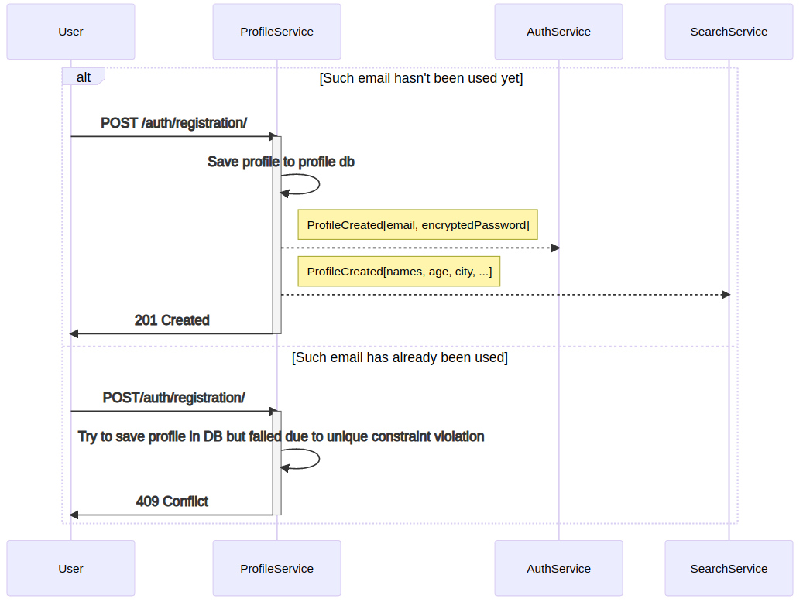

#### Аутентификация пользователя

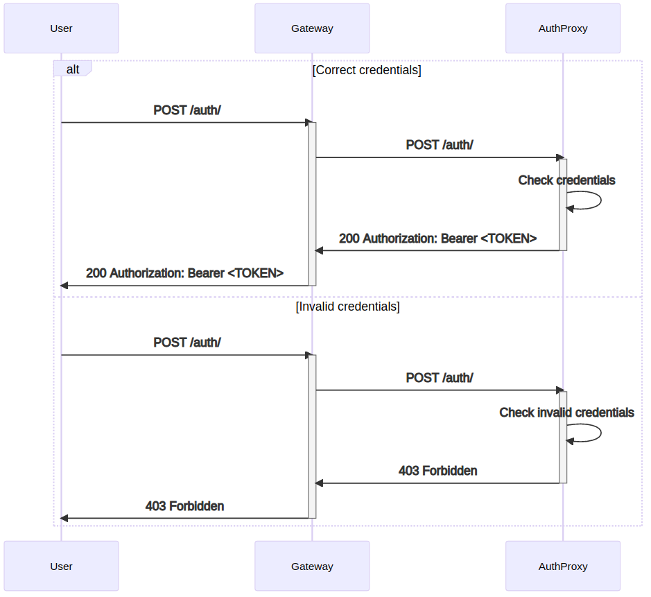

#### Страница с профилем

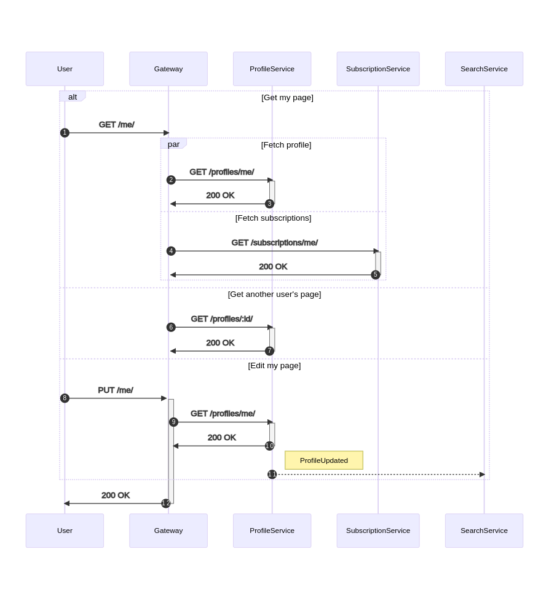

#### Поиск других пользователей

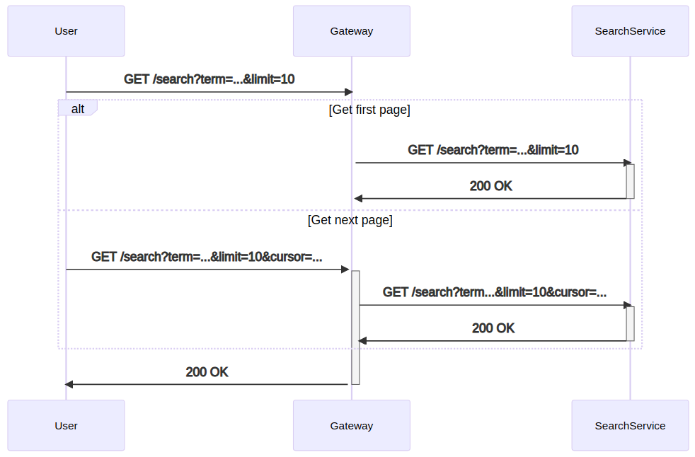

#### Подписка, отписка от пользователя

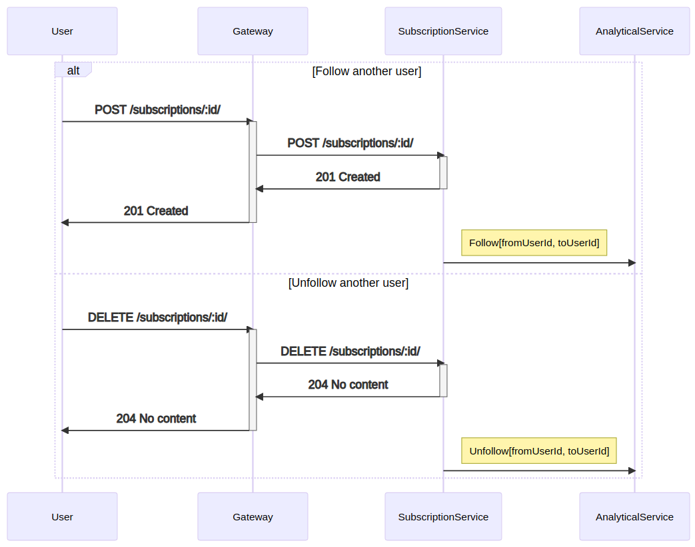

#### Посты

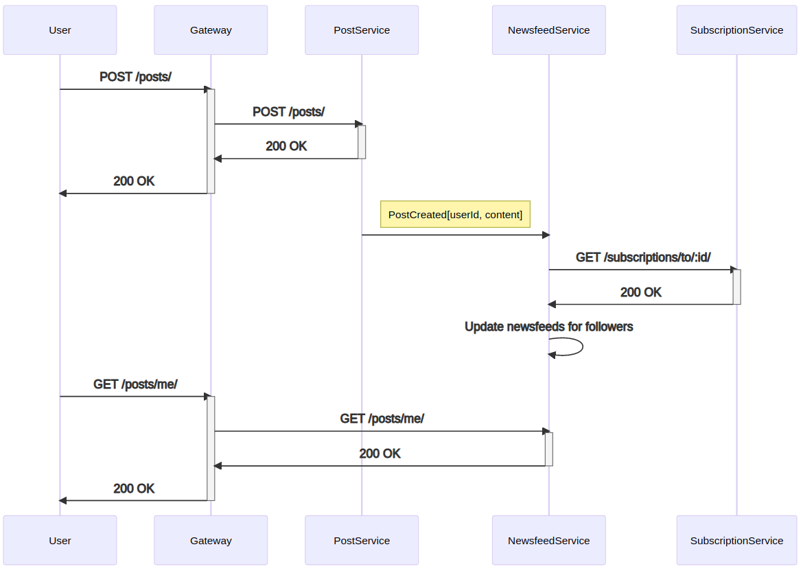

#### Сообщения

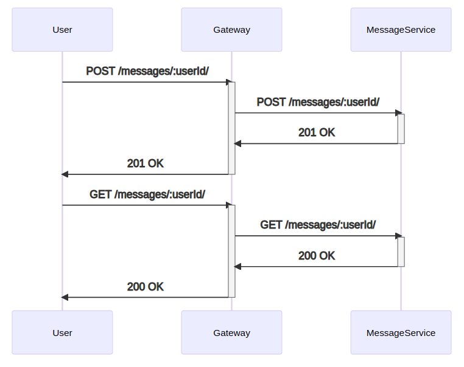
<<<<<<< HEAD

### Описание сервисов

#### AuthService

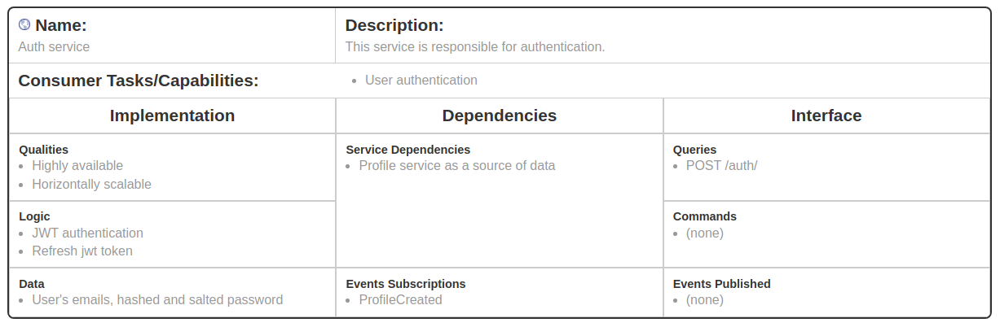

#### ProfileService

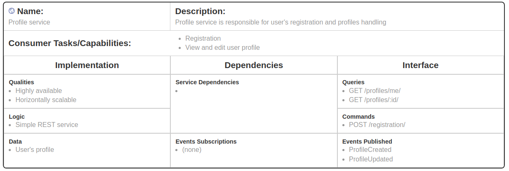

#### SearchService

#### MessageService

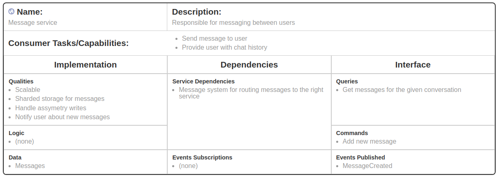

#### SubscriptionService

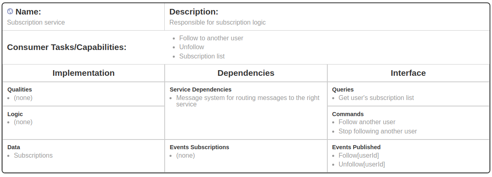

#### PostService

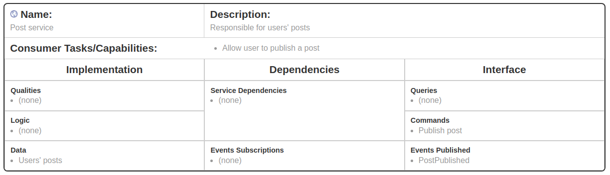

#### NewsfeedService

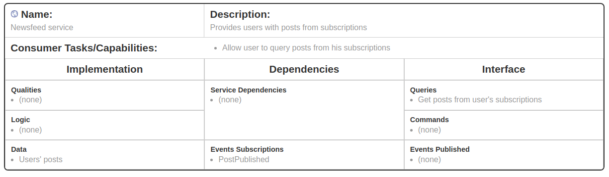
=======
