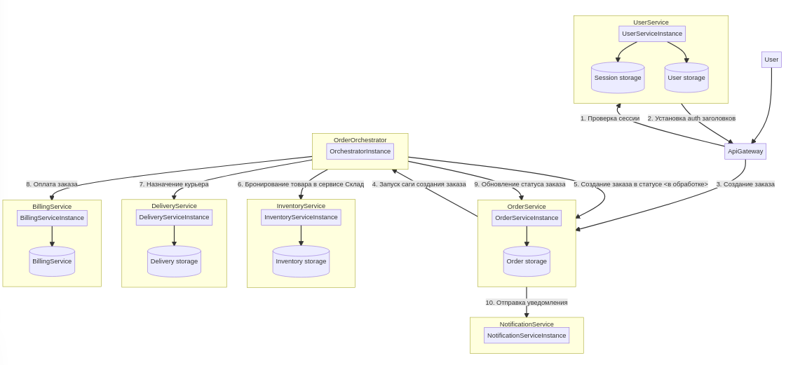

# Сервис заказов товаров онлайн.

## Пользовательские истории

* Регистрация пользователя
  * Как **незарегистрированный пользователь** я хочу иметь возможность **зарегистрироваться** в приложении, чтобы иметь возможность пользоваться им.
  
* Аутентификация
  * Как **зарегистрированный пользователь** я хочу иметь возможность **войти** в приложение, предоставляя свои **логин** и **пароль** указанные при регистрации, чтобы начать пользоваться функциональными возможностями приложения.

* Выход из приложения
  * Как **зарегистрированный пользователь** я хочу иметь возможность **выйти** из приложения, чтобы воспользоваться другим **аккаунтом**.

* Пополнение внутреннего счета
  * Как **зарегистрированный пользователь** я хочу иметь возможность пополнить свой **счет**, чтобы иметь возможность совершать **покупки**.
  * Как **зарегистрированный пользователь** я хочу иметь возможность узнать количество средств на моем **счету**.

* Поиск товара
  * Как **зарегистрированный пользователь** я хочу иметь возможность **найти** интересующий меня **товар**, чтобы узнать о наличии, цене и иметь возможность совершить покупку.
  * Информация о товаре включает в себя
    * Заголовок
    * Описание
    * Доступное количество товара
    * Стоимость единицы товара

* Покупка товара
  * Как **зарегистрированный пользователь** я хочу иметь возможность **купить** **товар**, потому что я хочу им обладать.

* История заказов
  * Как **зарегистрированный пользователь** я хочу иметь возможность просматривать историю своих **заказов**.

* Пополнение ассортимента
  * Как **администратор** я должен иметь возможность пополнять ассортимент **товаров**, чтобы в будущем их продать.

## Общая схема взаимодействия сервисов

## Описание сервисов

## Контракты 

[Описание контрактов](http://petstore.swagger.io/?url=https://raw.githubusercontent.com/ivahotin/otus-microservice-project/master/contracts/restapi.yaml)

## Альтернативы

* Сервис **UserService** будет объединен с сервисом **AuthService**. В этом случае можно будет объединить операции регистрации и создание профиля. Для сессий будет использовано отдельное хранилище типа KV.
* Сервис **StorageService** обеспечивает только базовый поиск по префиксу имени товара. Для того чтобы обеспечить более продвинутый поиск можно добавить дополнительный сервис **SearchService**. Новый сервис может подписаться на события из сервиса **StorageService** и обновлять движок полнотекстового поиска.
* Можно было бы обойтись без оркестратора, реализовав распределенные транзакции через хореографию. Однако это повышает сложность каждого сервиса (они должны слушать события из брокера сообщений), помимо этого требуется продумать содержимое событий. Я предпочел иметь единый оркестратор.
* Можно было бы реализовать авторизацию через jwt токены, чтобы избавиться от хранилища сессий. **ApiGateway** в таком случае проводил бы верификацию токена.